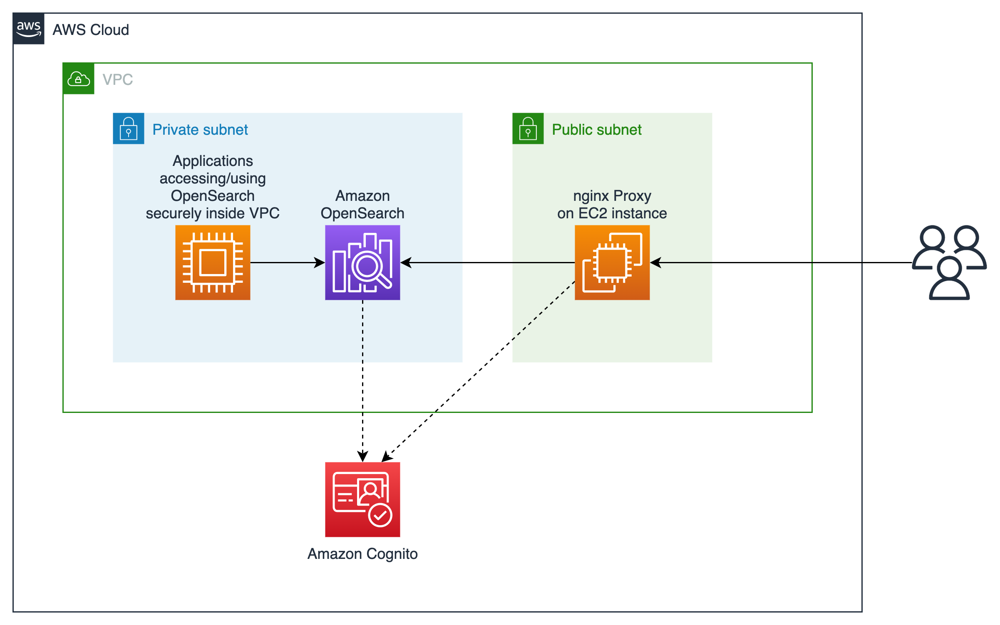

# OpenSearch in VPC

This repository contains a reusable [Terraform](https://www.terraform.io) module for deploying [Amazon OpenSearch Service](https://aws.amazon.com/opensearch-service) domain inside [Virtual Private Cloud (VPC)](https://aws.amazon.com/vpc). OpenSearch domain is exposed to the end users through a proxy [EC2](https://aws.amazon.com/ec2) instance, avoiding the need for SSH tunneling. [Amazon Cognito](https://aws.amazon.com/cognito) is used to provide an authentication mechanism.


## Background

Amazon OpenSearch Service domain can be deployed either as a publicly accessible service, or within a VPC. For improved security, it is recommended to deploy Amazon OpenSearch Service domain within a VPC.
However, customers that are just starting to use Amazon OpenSearch Service, may experience difficulties interacting with the domain that is deployed within the VPC, due to its endpoints being accessible only within the VPC itself.

To make it easier for customer to get up and running in such a setup, this repository provides a pre-configured Terraform module that shows how to:
- deploy Amazon OpenSearch Service domain within a VPC,
- expose its interactive UI endpoint through a proxy hosted within an EC2 instance,
- control access to the domain by using Amazon Cognito for user authentication.


## Architecture




## Content

The repository consists of two main parts:

- `opensearch-in-vpc-module` directory contains the reusable module, which can be copied into any Terraform project.
- `example` directory shows how to use the reusable module in a simple Terraform configuration.


## Deployment

Prerequisites:

- `terraform` executable is available in the `PATH`. Installation instructions are [here](https://www.terraform.io/downloads.html).

- `jq` is installed. Installation instructions are [here](https://stedolan.github.io/jq/download).

- [AWS CLI](https://aws.amazon.com/cli) is installed and configured. Installation instructions are [here](https://docs.aws.amazon.com/cli/latest/userguide/cli-chap-getting-started.html).

- AWS region is set:
    ```bash
    export AWS_REGION="us-east-1"
    ```

- AWS credentials are set, which can be done in one of the following ways:

    - If the credentials are configured in the `~/.aws/credentials` file, export the `AWS_PROFILE` environment variable referencing the profile you want to use:
        ```bash
        export AWS_PROFILE="MyProfileName"
        ```

    - Otherwise, if you have access key and secret access key, you can export them directly:
        ```bash
        export AWS_ACCESS_KEY_ID=...
        export AWS_SECRET_ACCESS_KEY=...
        ```

To obtain this code and deploy it, you can [clone this repository](https://git-scm.com/docs/git-clone) to a directory of your choice.

Example module can be deployed by navigating to its directory:

```bash
cd example
```

and executing following commands:

```bash
terraform init
terraform apply
```


## Usage

To access the OpenSearch domain through its UI, follow these steps:

1. Create a user in Cognito User Pool:

    - Navigate to [Cognito User Pools](https://console.aws.amazon.com/cognito/users)
    - Open your user pool (if you didn't modify code, it's named `my-example-opensearch`)
    - Click on "Users and groups" menu item on the left.
    - Click on "Create user" button.
    - Enter your email address in "Username" field.
    - Enter "Temporary password" if you want to define it, or leave it empty if you want to receive an automatically generated one per email.
    - Leave "Phone Number" field empty.
    - Remove the checkmark from "Mark phone number as verified?"
    - Enter your email address in "Email" field.
    - Set the checkmark in "Mark email as verified?"
    - Click on "Create user" button.

2. Access the UI through the proxy using one of the following two approaches:

    - After deploying the sample using `terraform apply` command, Terraform has shown several output values at the end of the execution, one of which is `opensearch_ui`. That value contains the URL to the UI. The URL is consisting of the IP address pointing to the EC2 instance hosting the [NGINX](https://www.nginx.com) proxy. If you didn't note the output, you can always see it again by running `terraform output` command from the `example` directory.
    - Alternatively, you can find the IP address of the proxy machine in [EC2 console](https://console.aws.amazon.com/ec2/v2/home). If you didn't modify code, it's named `my-example-opensearch-proxy`. Select the instance in the list an see the value of the "Public IPv4 address" in the "Details" pane underneath.

Once you have the IP address of the proxy instance, you can navigate to it through the browser. E.g. if the IP address is `xxx.xxx.xxx.xxx`, navigate to `https://xxx.xxx.xxx.xxx` in the browser.

Please be aware that the certificate used inside the proxy is a self-signed one and generated on the fly during the deployment of the proxy machine, which might result in a warning from your browser. In the real-world scenario, you should consider using a properly signed certificate, which you can install by modifying [proxy_instance_init_script.sh](opensearch-in-vpc-module/proxy_instance_init_script.sh) script.


## Cleanup

To remove the deployed resources, make sure you're in the `example` directory and run:

```bash
terraform destroy
```


## Planning for Production Workloads

Please note that the Amazon OpenSearch domain configured in this example consists of a single `t3.small.elasticsearch` data node. This is to avoid unexpected high costs while experimenting with the example code.
However, this is by far not the recommended configuration for operating production-grade OpenSearch domains. You should be using at least `m5.large.elasticsearch` nodes for production domains. For more information about sizing your OpenSearch domain properly for production usage, please take a look at following blog posts:

- [Best practices for configuring your Amazon OpenSearch Service domain](https://aws.amazon.com/blogs/big-data/best-practices-for-configuring-your-amazon-opensearch-service-domain)
- [Get Started with Amazon Elasticsearch Service: How Many Data Instances Do I Need?](https://aws.amazon.com/blogs/database/get-started-with-amazon-elasticsearch-service-how-many-data-instances-do-i-need)
- [Reducing cost for small Amazon Elasticsearch Service domains](https://aws.amazon.com/blogs/database/reducing-cost-for-small-amazon-elasticsearch-service-domains)


## Troubleshooting

The deployment of the OpenSearch domain might fail with the following error:

> _The specified instance type t3.small is not available for the AZ(s): [us-east-1e]._
> _If your domain is already using this instance type, consider moving to other available instance types._

In that case try to create subnets in a different availability zone, by changing the `availability_zone` [variable](example/variables.tf).
